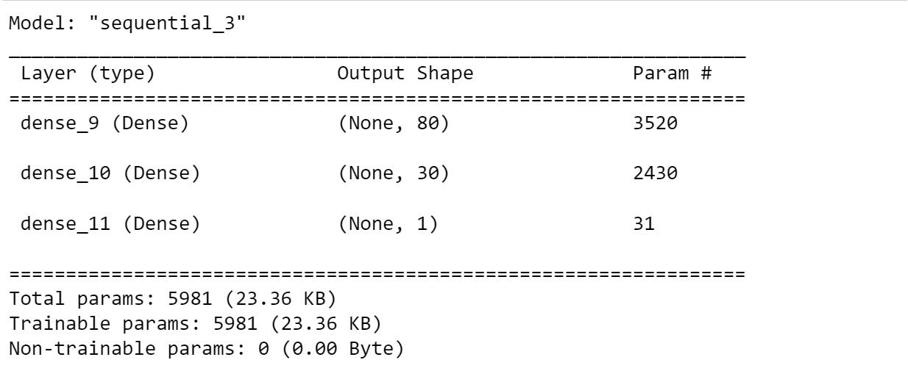
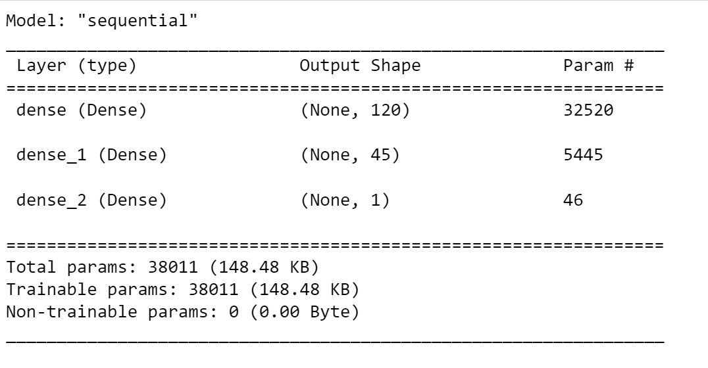
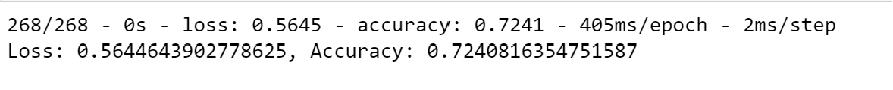
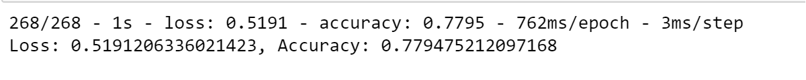

# Deep Learning Challenge

## Overview of the Analysis

The purpose of this project is to build a neural network model that can help the nonprofit foundation "Alphabet Soup" select the applicants for funding with the best chances of success. The data containing 34K organizations will be used to create a binary classifier that can predict whether applicants will be successful if funded by Alphabet Soup.

## Results

 1. Data Preprocessing

    - the target variable we are trying to predict ('y') is "IS_SUCCESSFUL"
    - The dataset includes a couple of features that will help us build our neural network model: NAME, APPLICATION_TYPE, AFFILIATION, CLASSIFICATION, USE_CASE, ORGANIZATION, STATUS, INCOME_AMT, SPECIAL_CONSIDERATIONS, ASK_AMT
    - Initially, we had dropped both EIN and NAME columns used to identify the organization and deemed not beneficial as features. As the initial model did not provide the desired results and the accuracy was below 75%, a decision was made to : 
         * Include the column NAME as many company names are repeating and interact with other features; and
         * Drop STATUS, SPECIAL_CONSIDERATION columns as they count only two unique values and have low to not existent variance.
   
 2. Compiling, Training, and Evaluating the Model

    - The initial model has 2 hidden layers. The first layer has 80 neurones and uses relu as activation function. The second layer has 30 neurons and uses relu as activation fucntion. The output layer uses sigmoid as activation function.

    - The second model (Optimization attempt) has 2 hidden layers. The first layer has 120 neurones and uses relu as activation function. The second layer has 45 neurons and uses relu as activation fucntion. The output layer uses sigmoid as activation function.

    - The initial model did not reach the desired results and has an accuracy of 72% knowing that the target model performance is 75%. Hence, we decided to attempt an optimization of the model. 

    - However, the second model exceeded the target performance and reached 77%.

    - Steps taken in our attempt to increase the model performance :
       * Dropping both columns STATUS and SPECIAL_CONSIDERATION as they were deemed not beneficial. Both columns has 2 distinct values an low to  not existent variance.
       * Keeping the column NAME as many company names are repeating and interact with other features.
       * Creating more bins for APPLICATION_TYPE and CLASSIFICATION.
       * Adding more neurons to our hidden layers.
       * Increasing the number of epochs.

## Summary

Our neural network model was able to perform better and not only reach the target performance but exceed it by giving an accuracy of 77% (versus 72% from the initial model). 

We may want to consider using a different algorithm to optimize our model, such as "Adamax". AdamX is well-suited for optimizing neural networks with sparse gradients and has been found to perform well in various deep learning tasks.